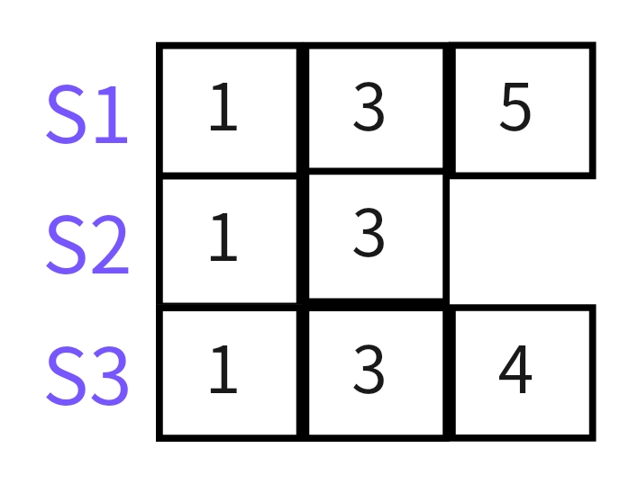

　　本项目为 Mit6.824 分布式课程的 Lab2，也就是实现Raft算法，它被划分成了 Lab2A、Lab2B、Lab2C 三个实验：
<ul>
  <li style="list-style-type:none;">
    <ul>
      <li>Lab2A：leader 选举（leader election）、心跳（heartbeat）。</li>
      <li>Lab2B：日志复制（Log replication）。</li>
      <li>Lab2C：状态存储（state persistent）。</li>
    </ul>
  </li>
</ul>

要求：<br>
- 不要使用 Go 内置的 timer

## 前言

### 1、Raft 算法介绍
　　分布式共识算法是一种用于在分布式系统中达成一致性的方法。为了达到这个目标，Raft 主要做了两方面的事情：
<ul>
  <li style="list-style-type:none;">
    <ul>
      <li>问题分解：把共识算法分位 3 个子问题，分别是领导者选举、日志复制、安全性。</li>
      <li>状态简化：对算法做出一些限制，减少状态数量和可能产生的变动。</li>
    </ul>
  </li>
</ul>


### 2、Raft 节点
　　在任何时刻，每一个服务器节点都处于 leader、follower 或 candidate 这三个状态之一。 <br>
　　正常运行的情况下，会有一个 leader，其他全为 follower，follower 只会响应 leader 和candidate 的请求，而客户端的请求则全部由 leader 处理，即使有客户端请求了一个 follower 也会将请求重定向到 leader。candidate 代表候选人，出现在选举 leader 阶段，选举成功后 candidate 将会成为新的 leader。 <br>
　　在 Raft 中，每个节点都维护了一个日志条目的有序序列，这些日志条目记录了系统中的操作。节点之间通过相互通信来进行日志的复制和同步，以达到一致的状态。

### 3、任期 term
　　在 Raft 协议中，将时间分成了一些任意长度的时间片，称为 term（也叫任期），term 使用连续递增的编号的进行识别，如下图所示：   

<div style="text-align: center;"> 
    
</div> 

　　任期的机制可以非常明确地标识集群的状态。并且通过任期的比较，可以帮助我们确认一台服务器历史的状态。   
　　term 也起到了系统中逻辑时钟的作用，每一个 server 都存储了当前 term 编号，在 server 之间进行交流的时候就会带有该编号。

### 4、RPC 通信
　　server 之间的交流是通过 RPC 进行的。Raft 中有两种 RPC：
<ul>
  <li style="list-style-type:none;">
    <ul>
      <li>RequestVote RPC（请求投票）：它由 candidate 在选举期间发起，用于拉取选票</li>
      <li>AppendEntries RPC（追加条目）：它由 leader 发起，用于复制日志或者发送心跳信号</li>
    </ul>
  </li>
</ul>


## 一、leader 选举

### 1.1、什么时候开启选举？
　　心跳超时时。 Raft 内部有一种心跳机制，如果存在 leader，那么它就会周期性地向所有 follower 发送心跳，来维持自己的地位。
如果 follower 一段时间没有收到心跳，那么它就会认为系统中没有可用的 leader 了，然后开始进行选举。<br>
　　心跳超时存在以下几种情况：leader 故障、网络超时、Raft 集群启动时。

### 1.2、leader 选举流程
　　follower 先增加自己的当前任期号，并转换到 candidate 状态。然后投票给自己，并且并行地向集群中的其他服务器节点发送投票请求
（RequestVote RPC）。之后 candidate 状态将可能发生如下三种变化:<br>
　　① 它获得超过半数选票赢得了选举，成功 leader 并开始发送心跳。<br>
　　② 其他节点赢得了选举，收到新的 leader 的心跳后，如果新 leader 的任期号不小于自己当前的任期号，那么就从 candidate 回到
      follower 状态。<br>
　　③ 一段时间之后没有获胜者，每个 candidate 都在一个自己的随机选举超时时间后增加任期号开始新一轮投票。

### 1.3、如何确保新的 leader 拥有集群中所有已提交日志？
　　方法：只给日志比自己新的机器投票。问题又来了，为什么这样可以保证选举出来的leader拥有所有的提交日志呢？<br>

**（1）以下图中的 a 举例 <br>**
　　假设 s1，s2 都崩溃了，则 leader 会从 3，4，5 中产生，包含了所有提交的日志。<br>
　　假设 s1 崩溃了，则 leader 会从 2，3，4，5 中产生，包含了所有提交的日志。 <br>

**（2）还是下图中的 a，不过假设这时 s3 也复制了日志 (2,2)，并且集群提交了日志 2(2,2)<br>**
　　如果 s1，s2 都崩溃了，则 leader 一定会是 s3，因为它不会投票给 s4 和 s5，包含了所有提交的日志。

<div style="text-align: center;"> 
    
</div> 

　　也就是说，由于票数过半才能当选为 leader，并且只给日志比自己新的节点投票。所以 leader 只会在包含全部已提交日志的机器上产生。如果没提交，则没有影响。

注：Raft 通过比较两份日志中最后一条日志条目的索引值和任期号来定义谁的日志比较新。<br>
　　① 如果两份日志最后条目的任期号不同，那么任期号大的日志更 “新”。<br>
　　② 如果两份日志最后条目的任期号相同，那么日志较长的那个更“新”。


## 二、日志复制
　　一条日志中需要具有三个信息：① 状态机指令；② leader 的任期号；③ 日志号（日志索引）；
### 2.1、日志一致性
- **性质 1：如果两个不同日志中的条目具有相同的索引和任期，那么它们存储相同的命令**。原因：相同任期和索引的日志只有一条，而且日志是按序复制的，故相同任期下，索引为 2 的日志是不会存在与索引为 1 的位置中。


- **性质 2：如果两个不同日志中的条目具有相同的索引和任期，那么这些日志在所有先前的条目中都是相同的**。原因：Raft 的一致性协议保证的。
### 2.2、日志复制的过程
　　两个步骤：① 日志复制；② 提交。<br>
　　生成日志后（心跳、写命令），leader 并行发送追加条目 RPC 给 follower（如果丢失会重发），让它们复制该条目。follower 收到日志后开始复制，
然后发送响应给 leader。leader 收到超过半数的复制成功消息后，开始提交，将日志更新至状态机并将结果返回客户端，而后再发送一个追加日志 RPC 触发 follower
的日志提交。最后 follower 收到提交请求时，开始进行提交。<br>
　　我们把本地执行指令，也就是 leader 应用日志到状态机这一步，称作提交（即执行该命令并且将执行结果返回客户端）。
<div style="text-align: center;"> 
    
</div> 

### 2.3、leader 什么时候会发送追加日志 RPC 来进行日志复制？

1、leader 收到客户端的命令时。<br>
2、ader 收到客户端的命令时。<br>
 


## 三、安全性
### 3.1、新 leader 是否提交之前任期内的日志条目

<div style="text-align: center;"> 
    
</div> 

　　① 假设在 c 中，S1 当选 leader 后提交了之前任期内的日志 2，而后 S1 崩溃了。<br>
　　② 这时假设 S5 当选 leader。因为日志号和 S2，S3 相同，但任期比 S2，S3 长。同时因为日志号和任期号都比 S4 长，因此也可以收到 S2，S3，S4 的选票。<br>
　　③ S5 当选后，发生了 follower 中的日志和新 leader 的日志不相同的情况，这时 Raft 会强制 follower 复制 leader 的日志来解决这个情况，即 S1，S2，S3，S4 
会强制复制 S5 的日志，并把日志 2 进行覆盖。<br>

　　因此，为了防止上面的情况发生，Raft 规定：<span style="color: red;">**leader 不能提交之前任期内未提交的日志**</span>。<br>

**1、日志的 “幽灵复现”**<br>
　　leader 不能提交之前任期内未提交的日志会进一步引出日志的 “幽灵复现” 问题。如下图 d1， 当 S5 当选 leader 并把 index=2 & term =3 的日志复制到了其他节点后，S5 还是不能提交该日志的。
但如果一直没新的请求进来，该日志岂不是就一直不能提交？<br>

```go
　　一个简单的例子就是转账场景，如果第一次查询转账结果时，发现未生效而重试，而转账事务日志作为幽灵复现日志重新出现的话，就造成了用户重复转账。
这个生效的时间如果太久，是不能够接收的。
```
　　所以 Raft 论文提到了引入 no-op 日志来解决这个问题。具体做法是：一个节点当选 leader 后，立刻发送一条自己当前任期的日志。这样，就可以把之前任期内满足提交条件的日志都提交了。如下图的 d2 所示。


<div style="text-align: center;"> 
    
</div> 


## 四、实现

### 3.1、网络
　　labrpc.Network 代表网络的抽象。<br>
**1、ends <br>**
　　Network 保存了每个 Raft 节点接收数据的端点（socket 的抽象），即 ClientEnd。举个例子，节点 0 中保存了 3 个端点，
0->0, 0->1, 0->2。每个端点中存在一个通道，往通道中写入请求，相当于往对应的节点发送请求。另外端点使用随机的字符串作为 key 来标识，如 
wcOrWWIZMDAR-P22WBi3。<br>
**2、enabled <br>**
　　Raf 集群中所有节点的启动状态，即机器是否开启。<br>
**3、endCh <br>**
　　网络中传输的 RPC 请求。Netwrok 创建后会启动一个 goroutine 专门来从该通道获取请求，然后进行处理。


### 3.2、Raft 
　　代表 Raft 的一个节点，即状态机。

```go
type Raft struct {
	mu        sync.Mutex
	peers     []*labrpc.ClientEnd   // 其他Raft节点上用于接收数据的端点
	persister *Persister
	me        int
	dead      int32

	state         RaftState
	appendEntryCh chan *Entry
	heartBeat     time.Duration    // 心跳间隔
	electionTime  time.Time        // 选举超时时间，一个绝对时间。

	currentTerm int
	votedFor    int
	log         Log    　 // 节点上的指令日志，严格按照顺序执行，则所有状态机都能达成一致

	commitIndex int
	lastApplied int

	nextIndex  []int
	matchIndex []int

	applyCh   chan ApplyMsg
	applyCond *sync.Cond
}
```

#### 1、Raft 节点的启动
　　节点的启动会在多种情况下发生，比如崩溃后重启，Raft 集群启动等。所以在启动需要先 kill 掉之前现有的节点实例。实现过程则是：① node 实例的状态设置为离线；② Network 保存的出站入站相关端点的状态设置为关闭；③ 删除 node 对应的 RPC 代理；<br>
　　在新增 node 实例后，会新建两个 Goroutine，一个作为定时器，周期性的触发心跳或者开启一个新的 leader 选举周期。另一个用于监听日志提交的 RPC 请求，并进行提交。<br>
　　最后还会为每个 node 创建一个 RPC 代理，用来接收并处理来自其他节点的 RPC 请求。
<div style="text-align: center;"> 
    
</div> 


#### 2、定时器（ticker）
　　每个 Raft 节点启动后，都会新建一个 Goroutine 来启动自己的定时器。如果是节点是 leader，则定时用来发送心跳包。否则，
判断是否应该开启新一轮的 leader 选举。
<div style="text-align: center;"> 
    
</div> 

### 3.3、leader 选举
　　启动新一轮 leader 选举时，首先要将自己转为 candidate 状态，并且给自己投一票。然后向所有其他节点请求投票。要注意当 candidate 收到半数以上投票之后就可以进入 leader 状态，而这个状态转变会更新 nextIndex[] 和  matchIndex[]，并且再成为 leader 之后要立刻发送一次心跳。我们希望状态转变只发生一次，因此这里使用了 go 的 sync.Once。<br>
　　leader 当选后立即给其他 follower 发送一个心跳包，其目的主要有 2 个：① 维持领导者地位；② 防止出现 “幽灵复现” 问题；

<div style="text-align: center;"> 
    
</div>

### 3.4、Candidate 投票过程（RequestVote）
　　**当一个节点收到比自己任期更大的请求投票 RPC**。说明自己的状态更旧，或者没有抢先发起 leader 选举（节点性能或者网络原因）。这时应该更新自己的任期为请求投票 RPC 的任期，将 status 设置为 Follower（表明该节点竞争 leader 失败），并比较日志的新旧程度（网速快不代表包括全部的已提交日志）。如果自己的更新，则不投票给请求投票节点，否则给其投票。<br>

　　**当一个节点收到比自己任期更小的请求投票 RPC**。说明请求投票节点的状态存在问题，请求投票节点的任期自增 1 后还是小于自己，只有一种情况：请求投票节点没有实时同步集群的状态，可能是崩溃重启，或者网络延迟的问题。这时应该拒绝投票。<br>

　　**当一个节点收到和自己任期相等的请求投票 RPC**。说明当前节点和请求节点在竞争同一个任期内的 leader，这时需要判断自己是否已经给别人或者自己投过票，如果投过（自己或者别人），则拒绝投票，否则给其投票。<br>

<div style="text-align: center;"> 
    
</div> 


### 3.5、日志复制（AppendEntries）

#### 1、leader 发送追加日志 RPC 请求的流程
　　leader 发送完追加日志 RPC 后，会收到来自 follower 的响应，这时的响应有如下几种情况：<br>
　　① follower 的 term 大于 leader 的 term，说明 leader 已经过时，可能是崩溃后重启，这时需要将自己转为 follower，并更新自己的 term。<br>
　　② follower 的 term 小于 leader 的 term，说明 follower 已经过时，此时 leader 的日志肯定是在 follower 中不存在，这时更新 leader 的 nextIndex -= 1。<br>
　　③ follower 的 term 等于 leader 的 term，此时存在两种情况，日志复制成功和日志冲突。日志复制成功则可以更新 leader 的 nextIndex += len(本次复制的日志)。日志冲突则需要根据 follower 冲突的原因进行不同的处理，具体情况如下如所示：

<div style="text-align: center;"> 
    
</div> 


#### 2、follower 收到追加日志 RPC 请求的流程
　　① <span style="color: red;">**请求的任期 < 当前节点的任期**</span>，说明发送请求的节点的状态已经过时，拒绝请求。举例：S1 为 leader，发送了一个追加日志 RPC，由于网络延时，并在此期间 S1 崩溃了，同时选举出了新的 leader S2，此时任期已经发生变化，这时 leader S2 收到追加日志时，应该丢弃。<br>
　　② <span style="color: red;">**请求的任期 > 当前节点的任期**</span>，说明当前节点可能时从故障崩溃中刚恢复过来，此时更新自己的任期=请求的任期，并结束返回响应。<br>
　　③ <span style="color: red;">**请求的任期 == 当前节点的任期 && 待同步日志的上一条日志的 index > 当前节点最新日志的 index**</span>，说明当前节点没有待同步日志的上一条日志，也即日志缺失，结束并返回结果。<br>
　　④ <span style="color: red;">**请求的任期 == 当前节点的任期 && 当前节点包含待同步日志的上一条日志 && 两个日志的 term 不同**</span>，说明在某个时间点，当前节点和领导者节点的日志发生了分叉，即两者在同一个日志索引处存储了不同的日志条目。如下图所示，S3 在同步 index 3 的日志时，发现 index 2 的日志和 S1 不一致，此时需要将本节点 index 2 的日志进行覆盖，保持和 leader 一致。
<div style="text-align: center;"> 
    
</div> 

　　⑤ <span style="color: red;">**请求的任期 == 当前节点的任期 && 当前节点包含待同步日志的上一条日志 && 两个日志的 term 相同**</span>，说明可以开始进行日志复制了，但还需要注意日志截断。如下图所示，S3 在同步 index 3 的日志时，上一个节点相同，但仍需要将本节点 index 3 的日志进行覆盖，从而保持和 leader 一致。
<div style="text-align: center;"> 
    
</div> 

　　另外，实现时并不是每个日志都使用一个追加日志 RPC 来发送，而是 leader 中会保存每个 follower 中最新的日志的 index，然后将 leader 所有 index > 保存的 index 的日志统一一起打包发送给 follower。如下图中的蓝色方块，它们将会一起被发送至 S3。
<div style="text-align: center;"> 
    
</div> 

#### 3、Raft 的日志一致性检查优化
　　问题：什么是　Raft 的一致性检查？<br>
　　答：保证 follower 日志和 leader 日志一致的手段。leader 在每一个发往 follower 的追加条目 RPC 中，会放入前一个日志条目的索引位置和任期号，如果 follower 在它的日志中找不到前一个日志，那么它就会拒绝此日志，leader 收到 follower 的拒绝后，会发送前一个日志条目，从而逐渐向前定位到 follower 第一个缺失的日志。<br>
　　一个一个的往前找下一个应该复制给 follower 的日志是不是太慢了？所以在 follower 的拒绝响应中增加了 XTerm、XIndex 等相关字段。<span style="color: red;">领导者根据这个字段来找到其自身日志中与冲突任期相同的最后一个条目位置，以便调整 nextIndex，从而有效地解决冲突</span>。具体情况可见 3.5 中的第一部分。<br>
```go
type AppendEntriesReply struct {
	Term     int
	Success  bool
	Conflict bool
	XTerm    int
	XIndex   int
	XLen     int
}
```
　　当 follower 发现其日志在 PrevLogIndex 位置的任期与领导者的 PrevLogTerm 不匹配时，它会将**冲突日志的任期**设置给 XTerm，同时通过 XIndex 向领导者提供其在**该冲突任期的最后一个条目的索引**。如果从节点在 PrevLogIndex 位置没有任何日志，XTerm 通常会被设置为 -1。<br>
　　① XTerm：表示冲突的日志条目的任期。<br> 
　　② XIndex：表示 follower 在 XTerm 任期内的最后一个日志条目的索引。<br>
　　③ XLen：表示 follower 的日志条目总长度。<br>

### 3.6、日志提交
　　leader 在每次复制日志到 follower 时，会在 RPC 中携带当前已经提交的日志位置（commitIndex）。如果 follower 复制成功，则会更新它的提交日志位置为 min(args.LeaderCommit, rf.log.lastLog().Index)，位置前面的日志代表已提交。问题：为什么是取 min(args.LeaderCommit, rf.log.lastLog().Index) 呢？
<div style="text-align: center;"> 
    
</div> 
　　答：因为对于 LeaderCommit 和 lastLog().Index 存在上面两种可能，这两种可能在更新 follower 的提交位置时，都需要设置为二者的较小值。另外，因为 LeaderCommit < leader.lastLog().Index，同时日志复制后的 follower.lastLog().Index 是等于 leader.lastLog().Index 的，所以不可能出现 LeaderCommit > follower.lastLog().Index 的情况。<br>
　　日志提交后，follower 就可以 apply 应用该日志的命令到状态机了。每个 Raft 节点在启动时都会专门启动一个 Goroutine 来专门应用日志命令到状态机中。


### 3.7、checkOneLeader
检查集群中是否只存在一个 leader。此处循环 10 次的原因是：分布式系统中某时刻正在选举，可能没有 leader。
<div style="text-align: center;"> 
    
</div> 


## 四、测试项
### 4.1、TestInitialElection2A
　　① 集群启动后，leader 选举是否成功。<br>
　　② 网络正常的情况下，2 个选举超时时间后，集群的 term 是否会改变，leader 是否正常。

### 4.2、TestReElection2A
　　主要测试了 leader 崩溃和重新连接的相关 case。<br>
　　① leader 崩溃后，新 leader 的产生。<br>
　　② 旧的 leader 重新加入，不影响新 leader 的选举（因为收到比自己任期大的 RPC 时，自身状态会变成 Follower）。<br>
　　③ 如果有效机器数不足一半，不应该选出 leader。<br>
　　④ 如果法定人数恢复，应该选出一个 leader。<br>
　　⑤ 旧的 leader 重新加入，不影响 leader 的存在。<br>

### 4.3、TestManyElections2A
　　测试 Leader 选举的健壮性。即在反复的节点断开和连接过程中，集群能够持续选举出 Leader。

### 4.4、TestBasicAgree2B
　　测试 leader 在收到日志请求时，是否能够复制到 Follower 节点，而后是否能够正常提交。


## AppendEntry

完成了leader election之后，leader会立刻触发一次心跳包，随后在每个心跳周期发送心跳包，来阻止新一轮leader election。
Figure 2中*Rules for Servers*的*Leaders*部分将心跳称为`initial empty AppendEntries RPCs (heartbeat)`，将包含log的RPC称为`AppendEntries RPC with log entries starting at nextIndex`。这种描述听起来像是用了两段不同的代码。
而实际上因为这里的心跳有两种理解：每个心跳周期，发送一次AppendEntries RPC，当这个RPC不包含log时，这个包被称为心跳包。所以也有可能发生这么一种情况：触发了一次心跳，但是带有log（即心跳周期到了，触发了一次AppendEntries RPC，但是由于follower落后了，所以这个RPC带有一段log，此时这个包就不能称为心跳包）。

实践中，我在每个心跳周期和收到新的command之后各会触发一次AppendEntries RPC。然而仔细读论文后发现，论文中并没有只说了心跳会触发AppendEntries RPC，并没有说收到客户端的指令之后应该触发AppendEntries RPC。

我甚至认为在理论上AppendEntries可以完全交给heartbeat周期来触发，即收到command后，并不立刻发送AppendEntries，而是等待下一个心跳。这种方法可以减少RPC的数量，并且通过了连续1000次测试。但是代价就是每条command的提交周期变长。

```go
func (rf *Raft) appendEntries(heartbeat bool) {
	lastLog := rf.log.lastLog()
	for peer, _ := range rf.peers {
		if peer == rf.me {
			rf.resetElectionTimer()
			continue
		}
		// rules for leader 3
		if lastLog.Index >= rf.nextIndex[peer] || heartbeat {
			nextIndex := rf.nextIndex[peer]
			if nextIndex <= 0 {
				nextIndex = 1
			}
			if lastLog.Index+1 < nextIndex {
				nextIndex = lastLog.Index
			}
			prevLog := rf.log.at(nextIndex - 1)
			args := AppendEntriesArgs{
				Term:         rf.currentTerm,
				LeaderId:     rf.me,
				PrevLogIndex: prevLog.Index,
				PrevLogTerm:  prevLog.Term,
				Entries:      make([]Entry, lastLog.Index-nextIndex+1),
				LeaderCommit: rf.commitIndex,
			}
			copy(args.Entries, rf.log.slice(nextIndex))
			go rf.leaderSendEntries(peer, &args)
		}
	}
}
```
Leader在AppendEntries中会并行地给所有server发送消息，然后根据返回的消息更新nextIndex和matchIndex，这部分需要按照论文5.3节来实现。
但是同样在5.3节，作者提到了fast rollback优化。Morris的讲座上，实现这种优化需要在返回消息中额外加入XTerm, XIndex, XLen三个字段。
```go
type AppendEntriesReply struct {
	Term     int
	Success  bool
	Conflict bool
	XTerm    int
	XIndex   int
	XLen     int
}
```
原作的说法上，这种优化可能不是必须的，所以并不作为raft核心算法的一部分。实际上，我感觉如果直接在raft-core的代码上实现，有可能会引入一个小bug，不影响运行但可能会拖效率。然而这点我也不好证明，只能说里面多半有一部分冗余代码，但是我也不敢删，所以就留着……

```go
func (rf *Raft) leaderSendEntries(serverId int, args *AppendEntriesArgs) {
	var reply AppendEntriesReply
	ok := rf.sendAppendEntries(serverId, args, &reply)
	if !ok {
		return
	}
	rf.mu.Lock()
	defer rf.mu.Unlock()
	if reply.Term > rf.currentTerm {
		rf.setNewTerm(reply.Term)
		return
	}
	if args.Term == rf.currentTerm {
		// rules for leader 3.1
		if reply.Success {
			match := args.PrevLogIndex + len(args.Entries)
			next := match + 1
			rf.nextIndex[serverId] = max(rf.nextIndex[serverId], next)
			rf.matchIndex[serverId] = max(rf.matchIndex[serverId], match)
		} else if reply.Conflict {
			if reply.XTerm == -1 {
				rf.nextIndex[serverId] = reply.XLen
			} else {
				lastLogInXTerm := rf.findLastLogInTerm(reply.XTerm)
				if lastLogInXTerm > 0 {
					rf.nextIndex[serverId] = lastLogInXTerm
				} else {
					rf.nextIndex[serverId] = reply.XIndex
				}
			}
		} else if rf.nextIndex[serverId] > 1 {
			rf.nextIndex[serverId]--
		}
		rf.leaderCommitRule()
	}
}
```
当peer收到AppendEntry RPC的时候，需要实现Figure 2中*AppendEntry RPC Receiver implementation* + *Rules for Servers*。具体哪些相关，我已经加在注释里了。论文里的步骤必须严格遵守，不要自由发挥。这一点想必大家在debug的时候都深有体会……

```go
func (rf *Raft) AppendEntries(args *AppendEntriesArgs, reply *AppendEntriesReply) {
	rf.mu.Lock()
	defer rf.mu.Unlock()
	// rules for servers
	// all servers 2
	reply.Success = false
	reply.Term = rf.currentTerm
	if args.Term > rf.currentTerm {
		rf.setNewTerm(args.Term)
		return
	}

	// append entries rpc 1
	if args.Term < rf.currentTerm {
		return
	}
	rf.resetElectionTimer()

	// candidate rule 3
	if rf.state == Candidate {
		rf.state = Follower
	}
	// append entries rpc 2
	if rf.log.lastLog().Index < args.PrevLogIndex {
		reply.Conflict = true
		reply.XTerm = -1
		reply.XIndex = -1
		reply.XLen = rf.log.len()
		return
	}
	if rf.log.at(args.PrevLogIndex).Term != args.PrevLogTerm {
		reply.Conflict = true
		xTerm := rf.log.at(args.PrevLogIndex).Term
		for xIndex := args.PrevLogIndex; xIndex > 0; xIndex-- {
			if rf.log.at(xIndex-1).Term != xTerm {
				reply.XIndex = xIndex
				break
			}
		}
		reply.XTerm = xTerm
		reply.XLen = rf.log.len()
		return
	}

	for idx, entry := range args.Entries {
		// append entries rpc 3
		if entry.Index <= rf.log.lastLog().Index && rf.log.at(entry.Index).Term != entry.Term {
			rf.log.truncate(entry.Index)
			rf.persist()
		}
		// append entries rpc 4
		if entry.Index > rf.log.lastLog().Index {
			rf.log.append(args.Entries[idx:]...)
			rf.persist()
			break
		}
	}

	// append entries rpc 5
	if args.LeaderCommit > rf.commitIndex {
		rf.commitIndex = min(args.LeaderCommit, rf.log.lastLog().Index)
		rf.apply()
	}
	reply.Success = true
}
```
完成AppendEntry RPC之后，Leader需要提交已有的日志条目，这一点在论文5.3 & 5.4有文字叙述。但是具体在什么时候提交，需要自己去把握。仔细看Figure 2的话，其实这部分对应*Rules for Servers*中Leader部分的最后一小段

```go
func (rf *Raft) leaderCommitRule() {
	// leader rule 4
	if rf.state != Leader {
		return
	}

	for n := rf.commitIndex + 1; n <= rf.log.lastLog().Index; n++ {
		if rf.log.at(n).Term != rf.currentTerm {
			continue
		}
		counter := 1
		for serverId := 0; serverId < len(rf.peers); serverId++ {
			if serverId != rf.me && rf.matchIndex[serverId] >= n {
				counter++
			}
			if counter > len(rf.peers)/2 {
				rf.commitIndex = n
				rf.apply()
				break
			}
		}
	}
}
```

## applier

student guide中提到应该使用一个`a dedicated “applier”`来专门处理日志commit的事情。所以按TA说的来，并且按照作业要求使用applyCond。这里可能会触发student guide所说的`The four-way deadlock`，不过guide中也给出了解决方案。不重复赘述，文末有中文版的链接，自己去读。

```go
func (rf *Raft) apply() {
	rf.applyCond.Broadcast()
}

func (rf *Raft) applier() {
	rf.mu.Lock()
	defer rf.mu.Unlock()

	for !rf.killed() {
		if rf.commitIndex > rf.lastApplied && rf.log.lastLog().Index > rf.lastApplied {
			rf.lastApplied++
			applyMsg := ApplyMsg{
				CommandValid: true,
				Command:      rf.log.at(rf.lastApplied).Command,
				CommandIndex: rf.lastApplied,
			}
			rf.mu.Unlock()
			rf.applyCh <- applyMsg
			rf.mu.Lock()
		} else {
			rf.applyCond.Wait()
		}
	}
}
```

## Start

最后是start函数，它会接受客户端的command，并且应用raft算法。前面也说了，每次start并不一定要立刻触发AppendEntry。理论上如果每次都触发AppendEntry，而start被调用的频率又超高，Leader就会疯狂发送RPC。如果不主动触发，而被动的依赖心跳周期，反而可以造成batch operation的效果，将QPS固定成一个相对较小的值。当中的trade-off需要根据使用场景自己衡量。

```go
func (rf *Raft) Start(command interface{}) (int, int, bool) {
	rf.mu.Lock()
	defer rf.mu.Unlock()
	if rf.state != Leader {
		return -1, rf.currentTerm, false
	}
	index := rf.log.lastLog().Index + 1
	term := rf.currentTerm

	log := Entry{
		Command: command,
		Index:   index,
		Term:    term,
	}
	rf.log.append(log)
	rf.persist()
	rf.appendEntries(false)

	return index, term, true
}
```

## 总结

1. 一定要按照论文+student guide来实现，完全按照论文确实可以完美复现。但是话说回来，都做到这份上了，为啥不直接给个伪代码版本。。。
2. 千万不要过早优化。直接使用函数粒度的锁，细粒度的锁在提升性能的同时，会增加复杂度，尤其debug的难度，并且这个难度在复杂的高并发+不可靠的网络背景下可以无限上升。等待debug难度过大，就只能删掉重构了。
3. 通过单次测试只是第一步，真正的考验才刚刚开始。很多bug出现的概率不高（话说统计课上将概率低于5%叫做小概率事件，然而这种bug到处都是……
4. 所以debug的log一定要写详细点，向我单跑一次TestFigure8Unreliable2C能打出两万条log
5. 接上条，早点写个log可视化的脚本来处理。Python写了一下，大约30多行，可以把45s左右的test过程，变成一个5分钟左右的动画，能看到每个server的append、commit等过程
6. 论文+student guide需要反复看，所以早点把重点摘出来写成笔记放在手边。我在微信上发了中文版的翻译


## 参考链接：

- https://github.com/s09g/raft-go/tree/main
- https://www.bilibili.com/video/BV1pr4y1b7H5/?spm_id_from=333.337.search-card.all.click&vd_source=ff9932351ef409bb94e9586a7891b82e
- https://www.bilibili.com/video/BV1CQ4y1r7qf/?spm_id_from=333.337.search-card.all.click&vd_source=ff9932351ef409bb94e9586a7891b82e


